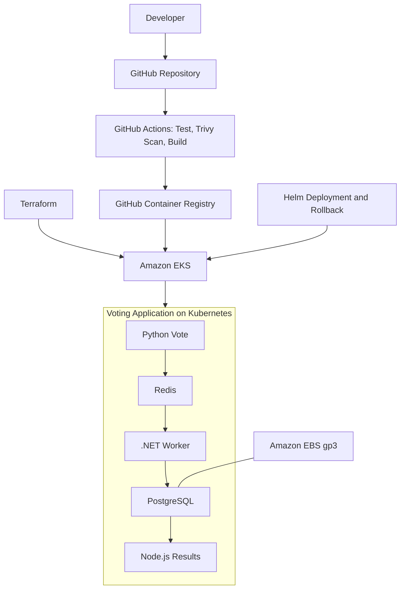

# DevOps Capstone Architecture

```mermaid
flowchart TD
    Developer["Developer"] --> GitHub["GitHub Repository"]
    GitHub --> CI["GitHub Actions: Test, Trivy Scan, Build"]
    CI --> GHCR["GitHub Container Registry"]
    Terraform["Terraform"] --> EKS["Amazon EKS"]
    GHCR --> EKS
    Helm["Helm Deployment and Rollback"] --> EKS
    subgraph App["Voting Application on Kubernetes"]
        Vote["Python Vote"] --> Redis["Redis"]
        Redis --> Worker[".NET Worker"]
        Worker --> DB["PostgreSQL"]
        DB --> Result["Node.js Results"]
    end
    EKS --> App
    EBS["Amazon EBS gp3"] --- DB
```
